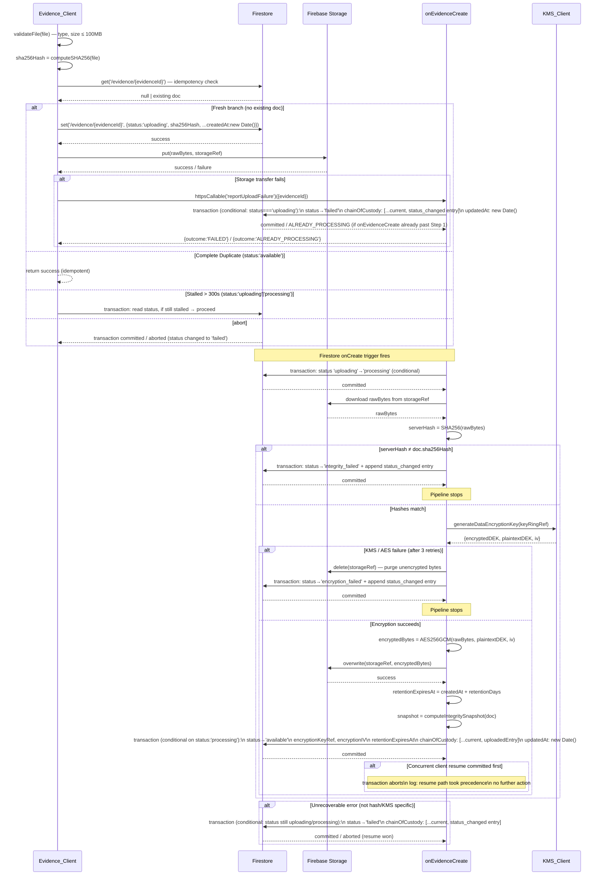

# Evidence Trail — Technical Design

## Overview

The Evidence Trail is a tamper-proof, legally defensible system for capturing, storing, and auditing digital evidence within the RAKSHA women's safety platform. It enables users to attach files (photo, video, audio, screenshot, document) to incident reports; each file is hashed on-device, encrypted at rest via Cloud KMS, and tracked through an immutable chain-of-custody log stored in Firestore. Evidence can be exported as court-ready PDF packages with full integrity verification.

The system is designed around three non-negotiable invariants:

1. **Integrity**: A file's SHA-256 hash is computed on the client before upload and re-verified server-side. Any mismatch permanently marks the document `integrity_failed`.
2. **Confidentiality**: Files are encrypted with AES-256-GCM using envelope encryption (Cloud KMS manages the key-encryption key) before any read access is permitted.
3. **Auditability**: Every action on every evidence document appends an immutable `ChainOfCustodyEntry` to a transaction-protected append-only array. The array is never modified by the client.

---

## Architecture

### Component Overview

```
┌─────────────────────────────────────────────────────────────────┐
│  Evidence_Client (React/TypeScript PWA)                         │
│  ┌──────────────┐  ┌──────────────┐  ┌──────────────────────┐  │
│  │ File Picker  │  │ Hash Engine  │  │ Upload State Machine  │  │
│  └──────┬───────┘  └──────┬───────┘  └──────────┬───────────┘  │
│         └─────────────────┴───────────────────────┘             │
└────────────────────────────┬────────────────────────────────────┘
                             │ Firebase SDK
          ┌──────────────────┼──────────────────┐
          ▼                  ▼                  ▼
   ┌────────────┐   ┌────────────────┐  ┌──────────────────┐
   │ Firestore  │   │Firebase Storage│  │  Firebase Auth   │
   │ /evidence/ │   │ (evidence files│  │  (JWT tokens)    │
   └─────┬──────┘   │  encrypted)    │  └──────────────────┘
         │           └───────┬────────┘
         │ onCreate trigger  │
         ▼                   │
┌─────────────────────────────────────────────────────────────────┐
│  Cloud Functions (Admin SDK)                                     │
│  ┌───────────────────┐  ┌──────────────────┐                    │
│  │ onEvidenceCreate  │  │generateLegalExport│                    │
│  ├───────────────────┤  ├──────────────────┤                    │
│  │processEvidenceExpiry│ │serveEvidenceFile │                    │
│  ├───────────────────┤  ├──────────────────┤                    │
│  │  setLegalHold     │  │releaseLegalHold  │                    │
│  ├───────────────────┤  ├──────────────────┤                    │
│  │grantEvidenceAccess│  │revokeEvidenceAccess│                  │
│  ├───────────────────┤  ├──────────────────┤                    │
│  │recordEvidenceViewed│ │reportUploadFailure│                   │
│  ├───────────────────┤  ├──────────────────┤                    │
│  │retriggerProcessing│  └──────────────────┘                   │
│  └─────────┬─────────┘                                          │
└────────────│────────────────────────────────────────────────────┘
             │
             ▼
      ┌─────────────┐
      │  KMS_Client │  (injectable interface)
      │  ┌────────┐ │
      │  │  Real  │ │  → Google Cloud KMS API
      │  ├────────┤ │
      │  │  Mock  │ │  → in-process random keys (emulator/test)
      │  └────────┘ │
      └─────────────┘
```

### Primary Data Flows

**Upload Flow (client → Firestore → Storage → Cloud Function → KMS → Storage → Firestore)**

1. Evidence_Client validates file type and size (≤ 100 MB).
2. Evidence_Client computes SHA-256 over raw file bytes on-device.
3. Evidence_Client runs the three-branch idempotency check against Firestore.
4. Evidence_Client creates the Firestore evidence document (`status: uploading`).
5. Evidence_Client transfers raw (unencrypted) file bytes to Firebase Storage.
6. Firestore `onCreate` trigger fires `onEvidenceCreate`.
7. `onEvidenceCreate` transitions status to `processing`, downloads raw bytes, verifies hash, encrypts, overwrites Storage object, stores key references, sets `retentionExpiresAt`, appends `uploaded` custody entry, and transitions status to `available` — all terminal writes inside transactions.

**Legal Export Flow (caller → generateLegalExport → Storage → KMS → PDF assembler)**

1. Caller authenticates and provides `incidentId`.
2. `generateLegalExport` verifies auth, confirms at least one evidence document exists.
3. For each evidence item: fetch encrypted bytes from Storage, call KMS to decrypt DEK, decrypt file bytes, collect metadata and full chain-of-custody log.
4. Assemble PDF with cover page, evidence files, per-item metadata tables, per-item chain-of-custody tables, and integrity verification report.
5. Append `exported` custody entry to each item inside a transaction.
6. Return PDF to caller. If any Storage file is inaccessible, abort — no partial output.

---

## Evidence Status State Machine

### Valid Status Values and Transitions

The system defines **eight** valid status values. The initial status `uploading` is set by the Evidence_Client; all subsequent transitions are performed exclusively by Cloud Functions via Admin SDK with conditional (optimistic-lock) writes.

```
                    ┌─────────────────────────────────────────────┐
                    │         TERMINAL STATES (no exit)           │
                    │  integrity_failed  encryption_failed  failed │
                    └─────────────────────────────────────────────┘
                           ▲              ▲          ▲
Evidence_Client            │              │          │
creates document           │              │          │
     ▼                     │              │          │
 uploading ──onEvidenceCreate──► processing           │
     │                     │              │           │
     │         hash mismatch│   KMS fails  │           │
     │                     │              │           │
     │                     └─integrity_failed         │
     │                                    └──encryption_failed
     │                                               │
     │         onEvidenceCreate succeeds             │ onEvidenceCreate
     └──────────────────────────────────────► available  unrecoverable error
                                                │         (conditional: status
                                                │          still uploading/processing)
                              setLegalHold ─────┘     ────────────────► failed
                                    ▼
                               legal_hold ◄──── releaseLegalHold ──────┐
                                    │                                    │
                                    └────────────────────────────────────┘
                                    (release sets new retentionExpiresAt)
                                    
                              processEvidenceExpiry
                    available ────────────────────────────────────► expired
                    (retentionExpiresAt < now, not legal_hold)
```

### Transition Table

| From | To | Actor | Condition |
|---|---|---|---|
| — | `uploading` | Evidence_Client | Fresh upload |
| `uploading` | `processing` | `onEvidenceCreate` | onCreate trigger, conditional write |
| `processing` | `available` | `onEvidenceCreate` | All pipeline steps succeeded, conditional write |
| `uploading`/`processing` | `integrity_failed` | `onEvidenceCreate` | Hash mismatch or 3 retries exhausted |
| `processing` | `encryption_failed` | `onEvidenceCreate` | KMS or AES failure |
| `uploading`/`processing` | `failed` | `onEvidenceCreate` | Unrecoverable error, conditional write within 5 min |
| `uploading` | `failed` | `reportUploadFailure` | Client Storage transfer failure; conditional write only if status still `uploading`; returns `ALREADY_PROCESSING` if pipeline is in-flight |
| `uploading` | `processing` | `retriggerProcessing` | Client resume after stall (>300s); conditional write checks both status and updatedAt staleness at commit time |
| `available` | `legal_hold` | `setLegalHold` | Owner request, non-empty legalHoldReason ≤ 1000 chars |
| `legal_hold` | `available` | `releaseLegalHold` | Owner request, resets retentionExpiresAt |
| `available` | `expired` | `processEvidenceExpiry` | retentionExpiresAt < now, conditional write |

All transitions use conditional Firestore transactions (optimistic locking on the `status` field). If a transaction aborts because `status` changed concurrently, the actor logs the abort and takes no further action — the winning actor's write stands.


---

## Race Condition Resolution: Req 2 vs Req 11

This section documents the explicit resolution for the concurrent paths that both activate when an evidence document has been in `uploading` or `processing` status for more than 300 seconds.

### The Conflict

- **Req 2.3 (Resume Path — client-initiated)**: When `updatedAt` is more than 300 seconds old, the Evidence_Client may attempt to resume the upload via a conditional transaction.
- **Req 11.5 (Error Path — Cloud Function-initiated)**: The `onEvidenceCreate` function must complete its `failed` conditional write within 5 minutes of an unrecoverable error — a window that overlaps with the 300-second staleness threshold.

At the 300-second mark, both actors may attempt to write to the same document simultaneously.

### Why "Client Precedence" Is a Misleading Label

The design previously described the resolution as "resume takes precedence." This framing is inaccurate and has been replaced. The actual mechanism is **first-committer-wins under optimistic locking**: both the client resume transaction and the Cloud Function's `failed` error-transition transaction use conditional Firestore transactions (checking `status` at commit time). Whichever commits first wins; the other aborts and yields. There is no elevated authority granted to either side.

The phrase "client precedence" was shorthand for "if the client commits first, the Cloud Function backs off." The converse is equally true: if the Cloud Function commits first, the client backs off. Both outcomes are safe.

### Why the Client Cannot Interrupt Legitimate In-Flight Processing

This is the critical safety question. The answer is that the resume path **structurally cannot activate** while `onEvidenceCreate` is legitimately progressing:

1. **Step 1 of `onEvidenceCreate`** transitions `uploading` → `processing` and updates `updatedAt` to the current time. Once Step 1 commits, the document's `updatedAt` is fresh.
2. **The resume path's staleness check** requires `now - updatedAt > 300s`. If `onEvidenceCreate` is actively progressing — updating `updatedAt` at each step — the staleness threshold is never reached.
3. **Therefore**: the resume path can only activate against a document where no Cloud Function has made forward progress for 300+ seconds. A legitimately in-flight `onEvidenceCreate` keeps `updatedAt` fresh throughout its pipeline and cannot be interrupted.

The race between the resume path and the Cloud Function is not "client vs. legitimate in-flight processing." It is "client vs. a Cloud Function that failed unrecoverably (Step 12 error path) and is trying to record that failure." Both outcomes of this specific race are safe:

- **Client wins**: The Cloud Function's `failed` transaction sees a status it wasn't expecting, aborts, and logs. The resume path re-initiates processing via `retriggerProcessing` (see below).
- **Cloud Function wins**: The document is `failed`. The client's resume transaction aborts. The client surfaces a terminal-failure error; the user must create a new evidence item.

### The Additional Staleness Guard on the Resume Transaction

To close a residual window — where the Cloud Function updates `updatedAt` between the client's read and the client's transaction commit — the resume transaction checks **two conditions** at commit time, not one:

1. `status` is still `uploading` or `processing`
2. `updatedAt` is still more than 300 seconds before the commit timestamp

If either condition is false at commit time (the Cloud Function just made progress and refreshed `updatedAt`), the transaction aborts. The client treats this as a `CONCURRENT_UPLOAD` condition and returns an error — the Cloud Function is still active.

```typescript
await db.runTransaction(async tx => {
  const doc = await tx.get(ref);
  const data = doc.data();
  const status = data.status;
  const stalenessSeconds = (Date.now() - data.updatedAt.getTime()) / 1000;

  if (status !== 'uploading' && status !== 'processing') {
    throw new Error('ABORT_TERMINAL'); // document reached a terminal state
  }
  if (stalenessSeconds <= 300) {
    throw new Error('ABORT_ACTIVE'); // Cloud Function made recent progress — do not resume
  }

  // Document is genuinely stalled — proceed with resume
  tx.update(ref, { status: 'uploading', updatedAt: new Date() }); // claim the document
});
```

After this transaction commits, the client calls `retriggerProcessing` to restart the Cloud Function pipeline.

### The Resume Mechanism: `retriggerProcessing`

A client resume does not re-create the Firestore document (which would fire a new `onCreate` trigger and corrupt the existing chain-of-custody log). Instead it calls the `retriggerProcessing` HTTPS callable Cloud Function:

**Why not re-create the document**: Deleting and re-creating the document would (a) generate a new `onCreate` trigger for a document that already has a chain-of-custody log, (b) lose the `createdAt` timestamp, and (c) create a gap in the audit trail.

**`retriggerProcessing` function design**:
1. Verify Firebase Auth token. Reject (401) if unauthenticated.
2. Read `/evidence/{evidenceId}`. Reject (404) if not found.
3. Verify `caller.uid == evidence.userId`. Reject (403) if not owner.
4. Verify document status is `uploading` and `updatedAt` was updated within the last 30 seconds (i.e., the resume transaction just claimed it). Reject if not — prevents double-triggering.
5. Re-upload detection: verify the file exists at `evidence.storageRef` in Storage. If not, return `FILE_NOT_FOUND` — the client must re-upload the file first, then call `retriggerProcessing`.
6. Execute the `onEvidenceCreate` pipeline steps (2–11) directly on the existing document, using Admin SDK. Step 1 (`uploading` → `processing`) uses the same conditional write as the original trigger.
7. The chain-of-custody log is preserved from before the stall — the `uploaded` entry will be appended at Step 11 as usual.

### Resolution Rules (Definitive)

1. **Both paths use conditional transactions** checking `status` at commit time. Neither can overwrite the other's committed state.
2. **The resume transaction additionally checks `updatedAt` staleness** at commit time. If the Cloud Function updated `updatedAt` recently, the resume transaction aborts — the Cloud Function is still active.
3. **First committer wins; loser aborts and logs.** There is no elevated authority on either side.
4. **If the client's resume transaction commits**: The Cloud Function's `failed` write sees an unexpected status, aborts, and logs. The client calls `retriggerProcessing` to continue processing.
5. **If the Cloud Function's `failed` transaction commits first**: The client's resume transaction aborts. The client surfaces a terminal-failure error. The user must create a new evidence item.
6. **Legitimate in-flight processing cannot be interrupted**: `onEvidenceCreate` keeps `updatedAt` fresh at each pipeline step. The resume path's staleness check structurally prevents activation against an actively progressing Cloud Function.

---

## Client Write Carve-Out: Security Analysis and Resolution

### The Vulnerability

The original design included a narrow Firestore security rule carve-out permitting the client to write `status: 'failed'` when the current status is `uploading` — motivated by Req 1.8's requirement to signal Storage transfer failures. This carve-out creates an exploitable race condition:

**The attack window**: `onEvidenceCreate` fires on the Firestore `onCreate` trigger, before the Storage upload completes. Its Step 1 is a conditional transaction (`uploading` → `processing`). Between document creation and Step 1 committing (~50–200ms under normal latency), a compromised or buggy client can race in a `status: 'failed'` write. If the client wins:

1. The Cloud Function's Step 1 transaction sees `status !== 'uploading'` and aborts. The entire pipeline stops.
2. The file was already uploaded to Storage (raw, unencrypted) but the Cloud Function never processed it — no hash verification, no encryption, no custody entry.
3. The document is `failed` with no `uploaded` custody entry. The file bytes are orphaned in Storage.
4. A compromised client could subsequently delete the Storage object (Storage rules permit client writes for the initial upload), leaving no trace.

This allows a compromised client to hide evidence it doesn't want recorded without any server-side audit trail.

**Why the mid-pipeline window (after Step 1) is safe**: Once `onEvidenceCreate` commits Step 1 (`uploading` → `processing`), the client's `failed` write would have been rejected anyway because the carve-out rule was conditioned on `resource.data.status == 'uploading'`. The vulnerability is strictly limited to the pre-Step-1 race window.

**Why Vector 2 (re-upload via false failure) is already blocked**: The three-branch idempotency logic treats `failed` as a terminal state and explicitly prohibits fresh uploads on the same `evidenceId`. That vector is safe regardless of this change.

### Resolution

The carve-out is **removed entirely**. The `allow update` rule on `/evidence/{evidenceId}` becomes `allow update: if false` — fully write-once from the client with no exceptions.

Storage transfer failures are signalled via the dedicated **`reportUploadFailure`** HTTPS callable Cloud Function instead of a direct Firestore write:

1. The client calls `reportUploadFailure(evidenceId)` on Storage transfer failure.
2. The function verifies Firebase Auth and that the caller is the document's owner.
3. It performs a conditional Firestore transaction: writes `failed` only if status is still `uploading` at commit time, appending a `status_changed` custody entry with `performedBy: 'cloud_function'`.
4. If status has already advanced to `processing` or beyond (the Cloud Function is already in-flight), the transaction aborts and the function returns `ALREADY_PROCESSING` to the client — the pipeline continues normally.

This means:
- The client never writes to Firestore after document creation, period.
- All `failed` transitions carry a server-recorded custody entry.
- A compromised client that races `reportUploadFailure` against a running `onEvidenceCreate` pipeline still loses cleanly: the conditional transaction ensures only one writer commits.
- `onEvidenceCreate` Step 1 is unchanged and unaffected.

### reportUploadFailure Function Design

**Trigger**: HTTPS callable, authenticated.

**Steps**:
1. Verify Firebase Auth token. Reject (401) if unauthenticated.
2. Read `/evidence/{evidenceId}`. Reject (404) if not found.
3. Verify `caller.uid == evidence.userId`. Reject (403) if not owner.
4. Run conditional transaction:
   - If `status === 'uploading'`: set `status: 'failed'`, append `status_changed` custody entry (`performedBy: 'cloud_function'`, reason: `'client_storage_failure'`), update `updatedAt`.
   - If `status !== 'uploading'`: abort — return `ALREADY_PROCESSING` to client.
5. Return result to client. Client shows the user an error if step 4 wrote `failed`; informs them the upload is still being processed if `ALREADY_PROCESSING`.

**Why `performedBy: 'cloud_function'`**: The write is executed by server-side code, not the client SDK. The `performedBy` field records the actual executor of the write. This is consistent with all other Cloud Function writes.

---

## Upload Flow — Client-Side Steps

### Step 1: Pre-Upload Validation

```typescript
function validateFile(file: File): ValidationResult {
  const SUPPORTED_TYPES = ['photo', 'video', 'audio', 'screenshot', 'document'];
  const MAX_SIZE_BYTES = 100 * 1024 * 1024; // 100 MB

  if (!SUPPORTED_TYPES.includes(deriveType(file.mimeType))) {
    return { valid: false, reason: `Unsupported file type: ${file.type}` };
  }
  if (file.size > MAX_SIZE_BYTES) {
    return { valid: false, reason: `File exceeds 100 MB limit (${file.size} bytes)` };
  }
  return { valid: true };
}
```

### Step 2: On-Device SHA-256 Hash Computation

The hash is computed over the raw file bytes using the Web Crypto API before any data leaves the device:

```typescript
async function computeSHA256(file: File): Promise<string> {
  const buffer = await file.arrayBuffer();
  const hashBuffer = await crypto.subtle.digest('SHA-256', buffer);
  return Array.from(new Uint8Array(hashBuffer))
    .map(b => b.toString(16).padStart(2, '0'))
    .join('');
}
```

### Step 3: Three-Branch Idempotency Check

```typescript
async function captureEvidence(evidenceId: string, file: File, metadata: EvidenceMetadata): Promise<UploadResult> {
  // Attempt to read existing document, with 1 retry on network error
  let existing: EvidenceDocument | null;
  try {
    existing = await fetchWithRetry(() => db.collection('evidence').doc(evidenceId).get(), 1);
  } catch (e) {
    return { success: false, error: 'NETWORK_ERROR', message: 'Could not determine current document status.' };
  }

  // Branch A: No document exists → fresh upload
  if (!existing) {
    return performFreshUpload(evidenceId, file, metadata);
  }

  // Branch B: Document already available → idempotent success
  if (existing.status === 'available') {
    return { success: true, evidenceId, idempotent: true };
  }

  // Branch C: Document is stalled (uploading/processing)
  if (existing.status === 'uploading' || existing.status === 'processing') {
    const staleness = (Date.now() - existing.updatedAt.getTime()) / 1000;

    // Active upload window — do NOT interfere
    if (staleness <= 300) {
      return { success: false, error: 'CONCURRENT_UPLOAD', message: 'Upload in progress — please wait.' };
    }

    // Stalled beyond 300 seconds — attempt conditional resume
    return performConditionalResume(evidenceId, existing, file, metadata);
  }

  // Terminal status (failed, integrity_failed, etc.) → do not retry on same evidenceId
  return { success: false, error: 'TERMINAL_FAILURE', message: `Evidence item is in terminal state: ${existing.status}` };
}
```

### Step 4: Firestore Document Creation (Fresh Upload)

All timestamp fields use `new Date()`. Firestore `Timestamp` is never imported:

```typescript
const now = new Date();
const evidenceDoc = {
  evidenceId,
  incidentId: metadata.incidentId,
  userId: auth.currentUser.uid,
  type: metadata.type,
  storageRef: `evidence/${evidenceId}/${file.name}`,
  originalFilename: file.name,
  mimeType: file.type,
  sizeBytes: file.size,
  sha256Hash,
  encryptionKeyRef: '',      // set by Cloud Function
  encryptionIV: '',          // set by Cloud Function
  status: 'uploading' as const,
  retentionExpiresAt: null,  // set by Cloud Function
  legalHoldReason: null,
  chainOfCustody: [],
  createdAt: now,
  updatedAt: now,
  metadata: {
    capturedAt: metadata.capturedAt,
    deviceInfo: metadata.deviceInfo,
    locationHash: metadata.locationHash ?? null,
    incidentContext: metadata.incidentContext ?? null,
  },
};
await db.collection('evidence').doc(evidenceId).set(evidenceDoc);
```

If `set()` throws, no Storage upload is attempted. The client shows the user an error message indicating the upload could not be started.

### Step 5: Firebase Storage Transfer

```typescript
const storageRef = storage.ref(`evidence/${evidenceId}/${file.name}`);
try {
  await storageRef.put(file);
} catch (e) {
  // Storage transfer failed. Signal failure via Cloud Function — never write Firestore directly.
  // reportUploadFailure performs a conditional write: marks 'failed' only if status is still
  // 'uploading'. If onEvidenceCreate already advanced to 'processing', this returns
  // ALREADY_PROCESSING and the pipeline continues to completion normally.
  const result = await functions.httpsCallable('reportUploadFailure')({ evidenceId });
  if (result.data.outcome === 'ALREADY_PROCESSING') {
    return { success: false, error: 'UPLOAD_IN_PROGRESS', message: 'Upload is being processed server-side.' };
  }
  throw new UploadError('Storage transfer failed — evidence document marked failed.');
}
```

The client never writes to the evidence document after creation. All status transitions — including the failure case — go through server-side Cloud Functions. This eliminates the pre-Step-1 race window where a compromised client could abort the `onEvidenceCreate` pipeline by winning a `status: 'failed'` write before the Cloud Function committed its first conditional transaction.


---

## onEvidenceCreate Cloud Function Pipeline

The `onEvidenceCreate` function is triggered by a Firestore `onCreate` event on `/evidence/{evidenceId}`. It executes the following ordered pipeline. Each step uses the injectable `KMSClient` interface.

### Step 1 — Transition `uploading` → `processing`

Conditional write. Aborts if status is not `uploading` at commit time (e.g., client already set to `failed`):

```typescript
await db.runTransaction(async tx => {
  const doc = await tx.get(ref);
  if (doc.data().status !== 'uploading') throw new Error('ABORT: status changed before processing');
  tx.update(ref, { status: 'processing', updatedAt: new Date() });
});
```

### Step 2 — Download Raw File Bytes from Storage

Download the unencrypted bytes that the client uploaded. Retry up to 3 times on transient failures (network timeout, 503):

```typescript
const rawBytes = await downloadWithRetry(storageRef, 3);
```

### Step 3 — Server-Side SHA-256 Verification

Compute SHA-256 over the downloaded bytes:

```typescript
const serverHash = computeSHA256Buffer(rawBytes);
const clientHash = doc.data().sha256Hash;
```

### Step 4 — Hash Mismatch Handling

If `serverHash !== clientHash`, terminate with `integrity_failed`:

```typescript
if (serverHash !== clientHash) {
  await db.runTransaction(async tx => {
    const current = await tx.get(ref);
    const custody = current.data().chainOfCustody ?? [];
    const entry: ChainOfCustodyEntry = {
      action: 'status_changed',
      performedBy: 'cloud_function',
      timestamp: new Date(),
      evidenceId,
      metadata: { expectedHash: clientHash, computedHash: serverHash, reason: 'hash_mismatch' },
      integritySnapshot: computeIntegritySnapshot(current.data()),
    };
    tx.update(ref, {
      status: 'integrity_failed',
      chainOfCustody: [...custody, entry],
      updatedAt: new Date(),
    });
  });
  return; // stop pipeline
}
```

### Step 5 — Generate DEK + IV via KMS

```typescript
const kms = createKMSClient(); // injectable factory
const { encryptedDEK, plaintextDEK, iv } = await kms.generateDataEncryptionKey(KEY_RING_REF);
```

On KMS failure, retry up to 3 times. If all retries fail, transition to `encryption_failed` (see Step 12).

### Step 6 — Encrypt File Bytes

Encrypt using AES-256-GCM:

```typescript
const encryptedBytes = await aesGcmEncrypt(rawBytes, plaintextDEK, iv);
```

### Step 7 — Overwrite Storage Object

Replace the raw bytes with encrypted bytes. The Storage object at `storageRef` now contains only ciphertext:

```typescript
await storageRef.save(encryptedBytes, { contentType: 'application/octet-stream' });
```

### Step 8 — Store Key References

Encode IV as a 24-character base64 string (128 bits / 6 bits per base64 char = ~21.3, but with standard base64 padding a 16-byte input produces 24 characters):

```typescript
const encryptionIV = iv.toString('base64'); // 16 bytes → 24 chars
const encryptionKeyRef = encryptedDEK;
```

These are written in the same final transaction (Step 11) to guarantee atomicity.

### Step 9 — Compute `retentionExpiresAt`

```typescript
const createdAt: Date = doc.data().createdAt;
const retentionDays = getRetentionPeriodDays(); // throws if outside [1, 3650]
const retentionExpiresAt = new Date(createdAt.getTime() + retentionDays * 86_400_000);
```

### Step 10 — Compute `integritySnapshot` for `uploaded` Entry

The integrity snapshot is a SHA-256 digest over the deterministic JSON of the immutable fields, keys sorted lexicographically:

```typescript
function computeIntegritySnapshot(doc: EvidenceDocument): string {
  const immutable = {
    createdAt: doc.createdAt.toISOString(),
    evidenceId: doc.evidenceId,
    incidentId: doc.incidentId,
    mimeType: doc.mimeType,
    originalFilename: doc.originalFilename,
    sha256Hash: doc.sha256Hash,
    sizeBytes: doc.sizeBytes,
    userId: doc.userId,
  }; // keys are already in lexicographic order
  return sha256(JSON.stringify(immutable));
}
```

### Step 11 — Append `uploaded` Entry + Transition to `available` (single transaction)

The custody append and the `available` transition are committed atomically:

```typescript
await db.runTransaction(async tx => {
  const current = await tx.get(ref);
  if (current.data().status !== 'processing') throw new Error('ABORT: unexpected status');
  const custody = current.data().chainOfCustody ?? [];
  const uploadedEntry: ChainOfCustodyEntry = {
    action: 'uploaded',
    performedBy: 'cloud_function',
    timestamp: new Date(),
    evidenceId,
    metadata: { sha256Hash: clientHash },
    integritySnapshot: computeIntegritySnapshot(current.data()),
  };
  tx.update(ref, {
    status: 'available',
    encryptionKeyRef,
    encryptionIV,
    retentionExpiresAt,
    chainOfCustody: [...custody, uploadedEntry],
    updatedAt: new Date(),
  });
});
```

`FieldValue.arrayUnion()` is **explicitly prohibited** for custody entry appends because it performs deep equality checks on object values, and Date objects inside the entry will cause silent deduplication of entries with the same field values. The read-spread-write pattern shown above is mandatory.

### Step 12 — Unrecoverable Error Path

If any step from 2–11 fails unrecoverably (3 retries exhausted for transient errors, or non-retriable error):

```typescript
const errorEntry: ChainOfCustodyEntry = {
  action: 'status_changed',
  performedBy: 'cloud_function',
  timestamp: new Date(),
  evidenceId,
  metadata: { reason: 'unrecoverable_error', errorCode: err.code, errorMessage: err.message },
  integritySnapshot: null,
};

try {
  await db.runTransaction(async tx => {
    const current = await tx.get(ref);
    const status = current.data().status;
    if (status !== 'uploading' && status !== 'processing') {
      // Resume path already committed — abort and yield
      logger.warn(`[onEvidenceCreate] failed-transition aborted for ${evidenceId} — resume path took precedence`);
      throw new Error('ABORT_YIELD');
    }
    const custody = current.data().chainOfCustody ?? [];
    const targetStatus = isEncryptionError ? 'encryption_failed' : 'failed';
    tx.update(ref, {
      status: targetStatus,
      chainOfCustody: [...custody, errorEntry],
      updatedAt: new Date(),
    });
  });
} catch (e) {
  if (e.message !== 'ABORT_YIELD') throw e;
  // Logged above — no further action
}
```

For `encryption_failed`: before committing, delete the Storage object to ensure no unencrypted bytes remain accessible:

```typescript
await storageRef.delete();
```

This write must complete before the `encryption_failed` transaction commits. If deletion fails, retry deletion up to 3 times. If deletion still fails, set status to `encryption_failed` anyway and log a critical alert for manual remediation — the document status signals the integrity problem even if the Storage cleanup is incomplete.


---

## Chain-of-Custody Append Protocol

### Mandatory Transaction Pattern

Every custody append — regardless of which Cloud Function performs it — MUST use the following pattern:

```typescript
await db.runTransaction(async tx => {
  const doc = await tx.get(ref);
  const current = doc.data().chainOfCustody ?? [];
  const newEntry: ChainOfCustodyEntry = {
    action,
    performedBy,
    timestamp: new Date(),    // ← MUST be native Date, never Firestore Timestamp
    evidenceId,
    metadata: metadata ?? null,
    integritySnapshot: computeIntegritySnapshot(doc.data()),
  };
  tx.update(ref, {
    chainOfCustody: [...current, newEntry],
    updatedAt: new Date(),
  });
});
```

### Why `FieldValue.arrayUnion()` Is Prohibited

Firestore's `FieldValue.arrayUnion()` performs deep structural equality to deduplicate array elements before writing. When a `ChainOfCustodyEntry` contains a `timestamp` field holding a JavaScript `Date` object, Firestore's equality check may silently discard entries whose Date values compare as equal by reference — which can happen if two entries are constructed within the same millisecond or if Date serialization is inconsistent across SDK versions. This causes **silent data loss** with no error surfaced to the caller.

The read-spread-write pattern avoids this entirely: the transaction reads the current array, appends the new entry by construction, and writes the complete array back. Atomicity is preserved by the transaction boundary.

### `integritySnapshot` Computation

The integrity snapshot is a SHA-256 digest over a deterministic JSON encoding of the evidence document's immutable fields:

**Immutable fields** (ordered lexicographically by field name):
- `createdAt` (serialized as ISO 8601 string)
- `evidenceId`
- `incidentId`
- `mimeType`
- `originalFilename`
- `sha256Hash`
- `sizeBytes`
- `userId`

```typescript
function computeIntegritySnapshot(doc: EvidenceDocument): string {
  const snapshot = {
    createdAt: doc.createdAt.toISOString(),
    evidenceId: doc.evidenceId,
    incidentId: doc.incidentId,
    mimeType: doc.mimeType,
    originalFilename: doc.originalFilename,
    sha256Hash: doc.sha256Hash,
    sizeBytes: doc.sizeBytes,
    userId: doc.userId,
  };
  return sha256(JSON.stringify(snapshot));
}
```

The field order in the object literal is intentionally lexicographic to ensure JSON.stringify produces a consistent key ordering (V8 preserves insertion order for string keys).

### Atomicity Guarantee

For every status transition accompanied by a custody append, **both writes are committed in the same transaction**. It is never possible to observe a document where the status has changed but the corresponding custody entry is absent, or vice versa. If the transaction aborts, neither write is committed.

---

## KMS Encryption Interface

### TypeScript Interface

```typescript
interface KMSClient {
  /**
   * Generates a new data encryption key (DEK) and returns:
   * - encryptedDEK: the DEK encrypted under the Cloud KMS key ring, base64-encoded
   * - plaintextDEK: the raw DEK bytes (used for AES encryption, not persisted)
   * - iv: a random 128-bit (16-byte) initialization vector
   */
  generateDataEncryptionKey(keyRingRef: string): Promise<{
    encryptedDEK: string;
    plaintextDEK: Buffer;
    iv: Buffer;
  }>;

  /**
   * Decrypts an encrypted DEK using the Cloud KMS key ring.
   * Returns the plaintext DEK bytes.
   */
  decryptDataEncryptionKey(encryptedDEK: string, keyRingRef: string): Promise<Buffer>;
}
```

### Real Implementation

Delegates to the Google Cloud KMS API (via `@google-cloud/kms`). `generateDataEncryptionKey` generates a random 256-bit DEK locally, encrypts it using the KMS `encrypt` API call with `keyRingRef`, and returns both the ciphertext (for storage) and the plaintext (for immediate use). The plaintext DEK is zeroed from memory after encryption completes.

### Mock Implementation (KMSMock)

Used in emulator and test environments. No external calls. Uses Node.js `crypto.randomBytes` for key and IV generation:

```typescript
class KMSMock implements KMSClient {
  private keys = new Map<string, Buffer>(); // keyRingRef → plaintext DEK

  async generateDataEncryptionKey(keyRingRef: string) {
    const plaintextDEK = crypto.randomBytes(32);  // 256-bit DEK
    const iv = crypto.randomBytes(16);             // 128-bit IV
    // "Encrypt" by base64-encoding for test purposes
    const encryptedDEK = Buffer.concat([plaintextDEK]).toString('base64');
    this.keys.set(encryptedDEK, plaintextDEK);
    return { encryptedDEK, plaintextDEK, iv };
  }

  async decryptDataEncryptionKey(encryptedDEK: string, _keyRingRef: string) {
    const key = this.keys.get(encryptedDEK);
    if (!key) throw new Error(`KMSMock: unknown encryptedDEK`);
    return key;
  }
}
```

### Injection Mechanism

A module-level factory function determines which implementation to instantiate:

```typescript
function createKMSClient(): KMSClient {
  if (process.env.FUNCTIONS_EMULATOR === 'true' || process.env.NODE_ENV === 'test') {
    return new KMSMock();
  }
  return new CloudKMSClient();
}
```

All Cloud Functions call `createKMSClient()` at function initialization time (not per-request), allowing test environments to inject the mock by setting the appropriate environment variable. The interface is defined in a shared `kms.interface.ts` file that is imported before any function that uses it.

---

## serveEvidenceFile Function Design

This HTTPS callable function mediates all evidence file access. Direct client reads of the Storage bucket are denied by Storage security rules.

### Steps

1. **Auth check**: Extract and verify Firebase Auth token from the request context. Reject immediately if unauthenticated (401).

2. **Fetch evidence document**: Read `/evidence/{evidenceId}` from Firestore. Reject if document does not exist (404).

3. **Authorization check**: Verify that the caller's `uid` either:
   - Matches `evidence.userId` (Owner), OR
   - Exists as an active (non-revoked) `GrantedContact` entry under `/grantedContacts/{evidence.userId}/contacts/{uid}`.
   Reject if neither condition is met (403).

4. **Fetch encrypted bytes**: Read the encrypted object from `evidence.storageRef` in Firebase Storage.

5. **Decrypt DEK**: Call `kmsClient.decryptDataEncryptionKey(evidence.encryptionKeyRef, KEY_RING_REF)` to recover the plaintext DEK.

6. **Decrypt file**: Decrypt the ciphertext using AES-256-GCM with the recovered DEK and `evidence.encryptionIV` (decode from base64 to get the 16-byte IV buffer).

7. **Append `viewed` custody entry**: The entry MUST be appended within 5 seconds of the function invocation timestamp. Use the mandatory transaction pattern. The `timestamp` on the entry must be a native `Date` from `new Date()`.

8. **Stream decrypted bytes**: Return the decrypted bytes to the caller with the original `mimeType` as the Content-Type header.

### Error Handling

- If the Storage file is inaccessible: return 503 with an error identifying the file.
- If KMS decryption fails: return 500, do not transmit any bytes.
- If the custody append fails: return 500, do not transmit any bytes (atomicity with step 7 is required per Req 5.5).
- If decryption produces an authentication tag failure (tampered ciphertext): return 500 with an integrity error; do NOT serve bytes.


---

## generateLegalExport Function Design

This HTTPS callable function assembles a court-ready PDF evidence package for a given `incidentId`.

### Steps

1. **Upfront auth check**: Verify Firebase Auth token. Reject immediately (401) if unauthenticated — before any query.

2. **Authorization check**: Verify the caller is either the Owner of the incident's evidence or holds an active `GrantedContact` relationship. Reject (403) before any assembly begins if unauthorized.

3. **Existence check**: Query Firestore for all evidence documents where `incidentId == requestedId`. If the result set is empty, reject with a descriptive error (404) — do not produce an empty package.

4. **For each evidence item**:
   a. Fetch encrypted bytes from Storage. If any file is inaccessible, collect the error and proceed to step 5 (fail-fast) — do not partially assemble.
   b. Decrypt using KMS + AES-256-GCM (same path as `serveEvidenceFile`).
   c. Collect all metadata fields: `type`, `capturedAt`, `deviceInfo`, `locationHash`, `mimeType`, `sizeBytes`.
   d. Collect the full `chainOfCustody` array.

5. **Abort on any inaccessible file**: If step 4a encountered any Storage errors, reject the entire request with an error identifying each inaccessible file. Return no partial output.

6. **Assemble PDF** with the following structure:
   - Cover page: incident ID, export timestamp, requesting user, total evidence count.
   - For each evidence item:
     - Evidence file (embedded for images/documents, referenced for video/audio with SHA-256 checksum).
     - Metadata table: type, capturedAt, deviceInfo, locationHash (if present), mimeType, sizeBytes.
     - Chain-of-custody table: one row per entry (action, performedBy, timestamp, integritySnapshot).
     - Integrity verification report: sha256Hash, current status. If status is `expired`, include notice: *"This evidence has passed its retention period. Retention expired: {retentionExpiresAt.toISOString()}"*.

7. **Append `exported` custody entry** to each included evidence item. Each append uses the mandatory transaction pattern. All appends are initiated concurrently (`Promise.all`); any failure rejects the entire export.

8. **Return PDF** to caller.

### Design Decision: Fail-Whole on Inaccessible Files

A partial export (e.g., 4 of 5 files) would be misleading in a legal context — a recipient might not realize files were omitted. The design requires all files to be present for the export to succeed. This is aligned with Req 9.6.

---

## processEvidenceExpiry Function Design

This Cloud Scheduler-triggered function runs on a configurable schedule (recommended: daily at 02:00 UTC).

### Steps

1. **Validate retention configuration**: Call `getRetentionPeriodDays()`. If the value is outside [1, 3650], log a critical error and abort the entire run — do not process any documents.

2. **Query eligible documents**:
   ```
   db.collection('evidence')
     .where('retentionExpiresAt', '<', new Date())
     .where('status', 'not-in', ['legal_hold', 'expired', 'failed', 'integrity_failed', 'encryption_failed'])
   ```

3. **For each eligible document** (process individually, continue-on-failure):

   a. Attempt a conditional transaction:
   ```typescript
   await db.runTransaction(async tx => {
     const doc = await tx.get(ref);
     const currentStatus = doc.data().status;
     // Guard: re-check that this document is still eligible
     if (['legal_hold', 'expired', 'failed', 'integrity_failed', 'encryption_failed'].includes(currentStatus)) {
       throw new Error('ABORT_INELIGIBLE');
     }
     const custody = doc.data().chainOfCustody ?? [];
     const entry: ChainOfCustodyEntry = {
       action: 'status_changed',
       performedBy: 'cloud_function',
       timestamp: new Date(),
       evidenceId: doc.data().evidenceId,
       metadata: { priorStatus: currentStatus, newStatus: 'expired' },
       integritySnapshot: computeIntegritySnapshot(doc.data()),
     };
     tx.update(ref, {
       status: 'expired',
       chainOfCustody: [...custody, entry],
       updatedAt: new Date(),
     });
   });
   ```

   b. If the transaction aborts with `ABORT_INELIGIBLE`, log and skip — another process (e.g., `setLegalHold`) changed the status between query and transaction commit.

   c. If any other error occurs, log the error including `evidenceId` and continue to the next document.

4. **Report**: Log total documents processed, total successes, and total failures.

### Design Decision: Continue-on-Failure

An individual document failure (e.g., Firestore transient error) must not abort the entire expiry run. Other documents due for expiry should still be processed. Per Req 8.2, the Cloud Function logs each failure and continues.

---

## Firestore Security Rules Design

### `/evidence/{evidenceId}` Rules

```javascript
match /evidence/{evidenceId} {
  // Allow create: authenticated user, document must be owned by the creator, initial status must be 'uploading'
  allow create: if request.auth != null
                && request.resource.data.userId == request.auth.uid
                && request.resource.data.status == 'uploading';

  // Allow read: Owner OR active GrantedContact
  allow read: if request.auth != null
              && (
                resource.data.userId == request.auth.uid
                || isActiveGrantedContact(request.auth.uid, resource.data.userId)
              );

  // Deny ALL updates from the client SDK — the document is fully write-once from the client.
  // All post-creation writes (status transitions, chainOfCustody appends, encryptionKeyRef,
  // encryptionIV, updatedAt) are performed exclusively by Cloud Functions via Admin SDK,
  // which bypasses these rules. There are no permitted client-side update exceptions.
  allow update: if false;

  // Deny delete: always
  allow delete: if false;
}
```

> **No client `failed` carve-out**: The previous design included a narrow rule permitting the client to set `status: 'failed'` when current status is `uploading`. This was removed because it created an exploitable race window between document creation and the Cloud Function's first conditional write. A compromised client could race a `failed` write before the Cloud Function committed `processing`, aborting the pipeline and leaving an unencrypted, unaudited file blob in Storage. Storage transfer failures are now signalled via the `reportUploadFailure` callable Cloud Function. See the "Client Write Carve-Out: Security Analysis and Resolution" section.

### `isActiveGrantedContact` Helper

```javascript
function isActiveGrantedContact(uid, ownerId) {
  return exists(/databases/$(database)/documents/grantedContacts/$(ownerId)/contacts/$(uid))
    && get(/databases/$(database)/documents/grantedContacts/$(ownerId)/contacts/$(uid)).data.revoked != true;
}
```

Checks that a non-revoked contact document exists at `/grantedContacts/{ownerId}/contacts/{uid}`.

### Firebase Storage Rules for Evidence Files

```javascript
match /evidence/{evidenceId}/{fileName} {
  // Deny ALL client reads — only Cloud Functions via Admin SDK may read
  allow read: if false;
  // Allow client write only for the initial upload (raw bytes before encryption)
  allow write: if request.auth != null
               && request.auth.uid != null;
               // Additional validation (file size ≤ 100 MB) enforced client-side
  // Cloud Functions use Admin SDK which bypasses these rules
}
```

Post-encryption, the Cloud Function overwrites the object via Admin SDK. The client has no mechanism to read the encrypted bytes after upload.


---

## Components and Interfaces

### Data Models

#### EvidenceDocument

```typescript
interface EvidenceDocument {
  evidenceId: string;
  incidentId: string;
  userId: string;
  type: 'photo' | 'video' | 'audio' | 'screenshot' | 'document';
  storageRef: string;
  originalFilename: string;
  mimeType: string;
  sizeBytes: number;
  sha256Hash: string;
  encryptionKeyRef: string;   // Cloud KMS key resource name (set by Cloud Function)
  encryptionIV: string;       // 128-bit IV, base64-encoded as 24-char string (set by Cloud Function)
  status: EvidenceStatus;
  retentionExpiresAt: Date | null;
  legalHoldReason: string | null;
  chainOfCustody: ChainOfCustodyEntry[];
  createdAt: Date;            // ← native Date, NEVER Firestore Timestamp
  updatedAt: Date;            // ← native Date, NEVER Firestore Timestamp
  metadata: EvidenceMetadata;
}

type EvidenceStatus =
  | 'uploading'
  | 'processing'
  | 'available'
  | 'expired'
  | 'legal_hold'
  | 'failed'
  | 'integrity_failed'
  | 'encryption_failed';

interface EvidenceMetadata {
  capturedAt: Date;           // ← native Date
  deviceInfo: string;
  locationHash: string | null;
  incidentContext: string | null;
}
```

#### ChainOfCustodyEntry

```typescript
interface ChainOfCustodyEntry {
  action: CustodyAction;
  performedBy: string;        // userId, 'system', or 'cloud_function'
  timestamp: Date;            // ← native Date, NEVER Firestore Timestamp
  evidenceId: string;
  metadata: Record<string, string> | null;
  integritySnapshot: string | null;
}

type CustodyAction =
  | 'uploaded'
  | 'viewed'
  | 'shared'
  | 'exported'
  | 'legal_hold_set'
  | 'legal_hold_released'
  | 'status_changed'
  | 'granted'
  | 'revoked';
```

#### GrantedContact (sub-collection)

```typescript
// /grantedContacts/{ownerId}/contacts/{contactUid}
interface GrantedContact {
  contactUid: string;
  ownerId: string;
  grantedAt: Date;
  revoked: boolean;
  revokedAt: Date | null;
}
```

### Timestamp Handling Rules

Timestamps are a first-class concern in this system. The following rules apply universally across all components:

1. **Creation**: All timestamps are created with `new Date()`. The Firestore `Timestamp` class is **never imported** in any evidence-related code.

2. **Deserialization**: When reading from Firestore, all timestamp fields must be explicitly validated as `instanceof Date`. If a field is not a `Date` (e.g., it deserialized as a Firestore `Timestamp` or `null`), the operation MUST abort:

```typescript
function assertDate(value: unknown, fieldName: string): Date {
  if (!(value instanceof Date)) {
    throw new TimestampDeserializationError(
      `Field '${fieldName}' deserialized as ${typeof value} (expected Date). ` +
      `Aborting operation to prevent data corruption.`
    );
  }
  return value;
}

// Usage when reading from Firestore:
const doc = await ref.get();
const data = doc.data();
const createdAt = assertDate(data.createdAt, 'createdAt');
const updatedAt = assertDate(data.updatedAt, 'updatedAt');
```

3. **Test fixtures**: All test fixtures must use `new Date(...)` for timestamp fields. No `Timestamp.fromDate()`, no `Timestamp.now()`.

4. **`toDate()` calls**: The Firestore SDK may deserialize timestamps as Firestore `Timestamp` objects in some configurations. If Firestore SDK settings require calling `.toDate()`, that conversion must happen immediately at the deserialization boundary and the resulting `Date` must pass the `assertDate` check before being used anywhere in business logic.

---

## Correctness Properties

*A property is a characteristic or behavior that should hold true across all valid executions of a system — essentially, a formal statement about what the system should do. Properties serve as the bridge between human-readable specifications and machine-verifiable correctness guarantees.*

### Property 1: File Acceptance Predicate is Consistent

*For any* file with a given MIME type and size, the `validateFile` function returns `valid: true` if and only if the type maps to one of `{photo, video, audio, screenshot, document}` and the size is at most 100,000,000 bytes (100 MB). No file in this set is rejected; no file outside this set is accepted.

**Validates: Requirements 1.1**

### Property 2: On-Device SHA-256 is Deterministic and Correct

*For any* sequence of bytes B, `computeSHA256(B)` always returns the same hexadecimal string, and that string equals the output of an independent reference SHA-256 implementation applied to B.

**Validates: Requirements 1.2, 3.1**

### Property 3: All Required Fields Present at Creation

*For any* valid file and metadata combination, the Firestore document created at upload time contains all of: `evidenceId`, `incidentId`, `userId`, `type`, `storageRef`, `originalFilename`, `mimeType`, `sizeBytes`, `sha256Hash`, `status: 'uploading'`, `createdAt`, `updatedAt`, and `metadata.capturedAt`. No field in this set is absent or null.

**Validates: Requirements 1.4, 11.2**

### Property 4: Upload Idempotency

*For any* sequence of `captureEvidence(evidenceId, ...)` calls, if any call in the sequence results in a document with status `available`, then all subsequent calls with the same `evidenceId` return a success result immediately without modifying the Firestore document or re-uploading to Storage.

**Validates: Requirements 2.1, 2.2, 2.5**

### Property 5: Staleness Window Branch Selection

*For any* evidence document D in status `uploading` or `processing`, and for any call to `captureEvidence` with D's `evidenceId`:
- If `now - D.updatedAt > 300s`: the function attempts a conditional resume transaction.
- If `now - D.updatedAt ≤ 300s`: the function returns `CONCURRENT_UPLOAD` error and does not write.

**Validates: Requirements 2.3, 2.4**

### Property 6: Integrity Verification Correctness

*For any* raw file bytes B uploaded to Storage and any evidence document D with `sha256Hash` field H, `onEvidenceCreate` sets D's status to `integrity_failed` if and only if SHA-256(B) ≠ H. When SHA-256(B) = H, the status proceeds toward `available` (unless a subsequent step fails).

**Validates: Requirements 3.1, 3.2**

### Property 7: integritySnapshot is Deterministic

*For any* evidence document D, calling `computeIntegritySnapshot(D)` any number of times with the same immutable field values always produces the same string. If any immutable field changes (which is prohibited), the snapshot changes.

**Validates: Requirements 3.3**

### Property 8: Encryption Before Availability

*For any* evidence document D, D.status is `available` only if D.encryptionKeyRef is non-empty, D.encryptionIV is a 24-character base64 string, and the Storage object at D.storageRef contains only encrypted (ciphertext) bytes — the original plaintext bytes are no longer present.

**Validates: Requirements 4.1, 4.2, P5**

### Property 9: Chain-of-Custody Monotonicity

The length of `D.chainOfCustody` for any evidence document D is non-decreasing over time. *For any* sequence of N valid custody-appending operations on D, after all N operations complete, `D.chainOfCustody.length` has increased by exactly N from its value before the sequence began.

**Validates: Requirements 5.3, 5.7**

### Property 10: Custody Entry Completeness

*For any* custody-appending operation on evidence document D, after the operation commits, there exists a `ChainOfCustodyEntry` in D.chainOfCustody with:
- `action` equal to the operation's designated action type,
- `performedBy` set to the appropriate actor identifier,
- `timestamp` that is an instance of JavaScript's native `Date` class,
- `evidenceId` equal to D.evidenceId.

**Validates: Requirements 5.1, 5.2**

### Property 11: Complete Client Write Exclusion

*For any* authenticated user U and any existing evidence document D, ANY client-side write to ANY field on D after initial document creation is rejected by Firestore security rules with an observable error — there are no permitted post-creation client exceptions. No post-creation client write ever commits.

**Validates: Requirements 6.2, 6.4, 11.6, 11.7**

### Property 12: Access Exclusivity

*For any* user U and any evidence document D, U can successfully read D if and only if `U.uid == D.userId` OR there exists an active (non-revoked) `GrantedContact` record linking U to D's owner. No other condition grants read access. All other users — including RAKSHA platform operators — receive a security rule denial.

**Validates: Requirements 7.1, 7.2, 7.3, P8**

### Property 13: Retention Expiry Arithmetic

*For any* valid retention period R (a whole number of days in [1, 3650]) and any evidence document D with `createdAt` timestamp T, D.retentionExpiresAt = T + R × 86,400,000 milliseconds (exactly, with no rounding).

**Validates: Requirements 8.1**

### Property 14: Legal Hold Preservation

*For any* evidence document D with `status == 'legal_hold'`, `processEvidenceExpiry` never transitions D to `expired`, regardless of D.retentionExpiresAt.

**Validates: Requirements 8.3, P7**

### Property 15: legalHoldReason Validation

*For any* `setLegalHold` request with `legalHoldReason` string S:
- If `S.length >= 1 && S.length <= 1000`: the request succeeds.
- If `S` is empty (`S.length == 0`) or `S.length > 1000`: the request is rejected with a validation error.

**Validates: Requirements 8.5**

### Property 16: No Partial Export

*For any* invocation of `generateLegalExport` for incident I, either the function returns a complete PDF package containing all evidence files associated with I, or it returns an error and produces no output. There is no outcome where a partial package (some files present, others absent) is returned.

**Validates: Requirements 9.6, P10**

### Property 17: Timestamp Type Invariant

*For any* evidence document D or `ChainOfCustodyEntry` E read from Firestore, all of the following are instances of JavaScript's native `Date` class: `D.createdAt`, `D.updatedAt`, `D.metadata.capturedAt`, `D.retentionExpiresAt` (when non-null), and every `E.timestamp` in `D.chainOfCustody`. No field in this set is a Firestore `Timestamp` instance, `null` (for non-nullable fields), `undefined`, or any other type.

**Validates: Requirements 10.1, 10.2, 10.3, P6**

### Property 18: Resume-or-Fail Exclusivity (Race Safety)

*For any* evidence document D with status `uploading` or `processing` where `now - D.updatedAt > 300s`:
- Exactly one of the following commits: the client's resume transaction (advancing D to a non-stalled status) OR the Cloud Function's `failed` transition (setting D.status to `failed`).
- Neither commits twice. Both never commit.
- Within 5 minutes of the Cloud Function encountering an unrecoverable error, D.status is no longer `uploading` or `processing`.

**Validates: Requirements 2.3, 2.7, 11.5, P9**


---

## Error Handling Summary

### Terminal State: `integrity_failed`

| Attribute | Value |
|---|---|
| **Trigger** | Server-side SHA-256 hash does not match `sha256Hash` field, OR 3 transient retries exhausted during hash verification (Storage read failure, timeout) |
| **Status set to** | `integrity_failed` |
| **Custody entry appended** | `action: 'status_changed'`, `performedBy: 'cloud_function'`, `metadata: { reason, expectedHash, computedHash }` |
| **Storage file** | Remains at original path (raw unencrypted bytes), but no read access is possible via normal paths since the document is not `available` |
| **Recovery** | None. User must create a new evidence item. The original file should be re-captured and re-uploaded. |

### Terminal State: `encryption_failed`

| Attribute | Value |
|---|---|
| **Trigger** | KMS `generateDataEncryptionKey` fails, or AES-256-GCM encryption operation fails, after 3 retries exhausted |
| **Status set to** | `encryption_failed` |
| **Custody entry appended** | `action: 'status_changed'`, `performedBy: 'cloud_function'`, `metadata: { reason, errorCode }` |
| **Storage file** | **Deleted before status transition commits.** Unencrypted bytes must not remain accessible. If deletion fails after 3 retries, status is still set to `encryption_failed` and a critical alert is raised for manual remediation. |
| **Recovery** | None. User must create a new evidence item. |

### Terminal State: `failed`

| Attribute | Value |
|---|---|
| **Trigger** | (a) `reportUploadFailure` callable Cloud Function invoked by client after Storage transfer failure — conditional write commits only if status is still `uploading`; OR (b) `onEvidenceCreate` encounters an unrecoverable non-KMS, non-hash error and its conditional transaction commits |
| **Status set to** | `failed` |
| **Custody entry appended** | `action: 'status_changed'`, `performedBy: 'cloud_function'`, `metadata: { reason: 'client_storage_failure' \| 'unrecoverable_error', errorCode? }` |
| **Storage file** | (a) May be absent (transfer never completed) or partial (transfer interrupted) — not accessible via `serveEvidenceFile` since document is not `available`; (b) May be partial or fully uploaded but unencrypted — Cloud Function pipeline was aborted before encryption |
| **Race handling** | If `onEvidenceCreate` is already past Step 1 when `reportUploadFailure` is called, `reportUploadFailure`'s transaction aborts with `ALREADY_PROCESSING`; the pipeline continues normally and will reach `available` or another terminal state. If `reportUploadFailure` commits first (status still `uploading`), `onEvidenceCreate`'s Step 1 transaction aborts and the pipeline stops cleanly. |
| **Recovery** | None for the same `evidenceId`. User must create a new evidence item with a new `evidenceId`. |

### Non-Terminal State: `expired`

| Attribute | Value |
|---|---|
| **Trigger** | `processEvidenceExpiry` determines `retentionExpiresAt < now` and status is not `legal_hold` |
| **Status set to** | `expired` |
| **Custody entry appended** | `action: 'status_changed'`, `performedBy: 'cloud_function'`, `metadata: { priorStatus, newStatus: 'expired' }` |
| **Storage file** | Retained. The file remains in Storage and can be included in `generateLegalExport` (with a retention-expiry notice in the integrity report). |
| **Recovery** | Owner can set `legal_hold` before expiry to prevent this transition. After expiry, the document is read-only; the file is exportable but no further processing is performed. |

---

## Component Interaction Diagram

The following Mermaid sequence diagram shows the Upload Flow, including conditional status transitions and the chain-of-custody append:



---

## Testing Strategy

### Dual Testing Approach

This feature uses both example-based unit tests and property-based tests. The property-based tests directly exercise the 18 correctness properties defined above.

**Unit tests** focus on:
- Specific error conditions (Storage failure sets `failed`, Storage access denied returns 403).
- Integration points between components (client → Firestore → Storage sequencing).
- Edge cases covered by property generators (boundary values: exactly 100 MB, exactly 300s, exactly 1000 chars).
- Auth rejection paths (unauthenticated requests to Cloud Functions).

**Property tests** focus on:
- Universal invariants that hold across all valid inputs (timestamp types, field completeness, hash correctness).
- Idempotency properties (upload idempotency, expiry non-re-expiry).
- Monotonicity properties (chain-of-custody length never decreases).
- Branch selection logic (three-branch upload, access exclusivity).

### Property-Based Testing Library

Use **fast-check** (TypeScript-native) for all property-based tests. Minimum 100 iterations per property test.

Tag format for each property test:
```
// Feature: evidence-trail, Property {N}: {property_text}
```

### Property Test Configuration

```typescript
import fc from 'fast-check';

// Example: Property 2 — SHA-256 determinism
test('P2: SHA-256 hash is deterministic and correct', () => {
  // Feature: evidence-trail, Property 2: On-Device SHA-256 is Deterministic and Correct
  fc.assert(
    fc.property(fc.uint8Array({ minLength: 0, maxLength: 10_000_000 }), (bytes) => {
      const hash1 = computeSHA256(Buffer.from(bytes));
      const hash2 = computeSHA256(Buffer.from(bytes));
      expect(hash1).toBe(hash2);
      expect(hash1).toBe(referenceSHA256(bytes));
    }),
    { numRuns: 100 }
  );
});
```

### Arbitrary Generators Required

The following `fast-check` arbitrary generators should be defined for reuse across tests:

- `arbEvidenceType`: `fc.constantFrom('photo', 'video', 'audio', 'screenshot', 'document')`
- `arbValidFile`: `fc.record({ type: arbEvidenceType, size: fc.integer({ min: 1, max: 100_000_000 }), mimeType: fc.string() })`
- `arbInvalidFile`: files outside the valid set (unsupported type, or size > 100 MB)
- `arbEvidenceDocument`: complete EvidenceDocument with all fields, timestamps as `new Date(...)`
- `arbChainOfCustodyEntry`: complete ChainOfCustodyEntry with timestamp as `new Date(...)`
- `arbLegalHoldReason`: `fc.string({ minLength: 1, maxLength: 1000 })`
- `arbInvalidLegalHoldReason`: empty string or string with length > 1000
- `arbRetentionDays`: `fc.integer({ min: 1, max: 3650 })`
- `arbStalenessSeconds`: `fc.integer({ min: 0, max: 3600 })`

### Test Environment Setup

- Use **Firebase Emulator Suite** for all Firestore and Storage interactions in tests.
- Set `FUNCTIONS_EMULATOR=true` or `NODE_ENV=test` to activate `KMSMock` — no real Cloud KMS calls in tests.
- All test fixtures use `new Date(...)` for timestamps — no `Timestamp.fromDate()`.
- Tests are run with `vitest --run` (single execution, no watch mode) or `jest --runInBand` for CI.

### Coverage Targets

- All 18 correctness properties must have corresponding property-based tests.
- All terminal error states (`integrity_failed`, `encryption_failed`, `failed`, `expired`) must have dedicated unit tests.
- Firestore security rules must be tested using the Firebase Emulator's rules testing library.
- The three-branch idempotency logic must have tests for all three branches plus the concurrent-abort path.
